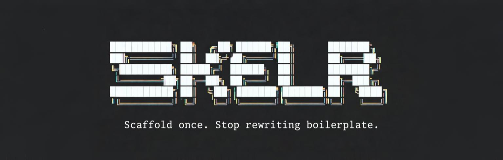

<div align="center">



**Service Scaffolding CLI — Generate production-ready service files in seconds.**

[](https://www.npmjs.com/package/skelr)
[](https://opensource.org/licenses/MIT)
[](https://nodejs.org)
[](https://www.npmjs.com/package/skelr)

[Features](#-features) • [Installation](#-installation) • [Quick Start](#-quick-start) • [Configuration](#-configuration) • [API](#-api)

</div>

---

> ⚠️ **Repository Renamed**: This project has moved from `scaffold-service` to `skelr`.
> 
> - **Old (Deprecated)**: https://github.com/abubakar-shaikh-dev/scaffold-service
> - **New**: https://github.com/abubakar-shaikh-dev/skelr
> 
> Please update your bookmarks and git remotes.

---

## ✨ Features

| Feature | Description |
|---------|-------------|
| 🏗️ **Two Architecture Modes** | Choose between **Separate** (layer-based) or **Modular** (domain-driven) structures |
| 📘 **TypeScript Support** | Generate `.ts` files with proper type annotations |
| ⚡ **CRUD Generation** | Auto-generate complete Create, Read, Update, Delete operations |
| 🔧 **Config File Support** | Pre-configure defaults with `.skelrrc.json` |
| 🚀 **Non-Interactive Mode** | Skip prompts with CLI flags for automation |
| 🎨 **Beautiful CLI** | Interactive prompts with color-coded output |
| 📦 **Zod Validations** | Pre-configured validation schemas with type inference |
| 🗑️ **Soft Delete** | Built-in soft delete support (timestamp or boolean) |

---

## 📦 Installation

### Run with npx (Recommended)
```bash
npx skelr
```

### Global Installation
```bash
npm install -g skelr
```

---

## 🚀 Quick Start

### Interactive Mode

Simply run the command and follow the prompts:

```bash
npx skelr
```

The CLI will guide you through:
1. **Folder Structure** — Separate or Modular
2. **Language** — JavaScript or TypeScript
3. **CRUD APIs** — Generate pre-made CRUD operations (optional)
4. **Service Name** — Enter a snake_case name
5. **Preview & Confirm** — Review and create files

### Non-Interactive Mode

Skip all prompts with CLI flags:

```bash
# TypeScript + Modular structure
skelr --name=payment --structure=modular --typescript

# JavaScript + Separate structure
skelr -n user_profile -s separate

# Show help
skelr --help
```

---

## 🎛️ CLI Options

| Flag | Short | Description |
|------|-------|-------------|
| `--name <name>` | `-n` | Service name in snake_case |
| `--structure <type>` | `-s` | `separate` or `modular` |
| `--typescript` | `-ts` | Generate TypeScript files |
| `--help` | `-h` | Show help message |

---

## ⚙️ Configuration

Create a `.skelrrc.json` file in your project root to pre-configure defaults:

```json
{
  "structure": "modular",
  "language": "ts",
  "crud": {
    "enabled": true,
    "soft_delete": "timestamp"
  }
}
```

### Configuration Options

| Option | Values | Description |
|--------|--------|-------------|
| `structure` | `"separate"` \| `"modular"` | Default folder structure |
| `language` | `"js"` \| `"ts"` | Default programming language |
| `crud.enabled` | `true` \| `false` | Enable CRUD generation by default |
| `crud.soft_delete` | `"timestamp"` \| `"boolean"` | Soft delete approach |

When a config file is detected, skelr will use these values as defaults (you can still override via CLI flags).

---

## 📂 Folder Structures

### Option 1: Separate (Layer-Based)

*Best for: Traditional MVC, large teams with strict separation of concerns*

```
src/
├── controllers/
│   └── payment.controller.ts
├── services/
│   └── payment.service.ts
├── validations/
│   └── payment.validation.ts
└── routes/
    └── v1/
        └── payment.routes.ts
```

### Option 2: Modular (Domain-Driven)

*Best for: Microservices, feature-based organization, high cohesion*

```
src/
└── modules/
    └── payment/
        ├── payment.controller.ts
        ├── payment.service.ts
        ├── payment.validation.ts
        └── payment.routes.ts
```

---

## 🔥 CRUD Generation

When you enable CRUD APIs, skelr generates complete implementations:

### Generated Endpoints
| Method | Route | Description |
|--------|-------|-------------|
| `POST` | `/` | Create new record |
| `GET` | `/` | Get all records (paginated) |
| `GET` | `/:id` | Get record by ID |
| `PUT` | `/:id` | Update record by ID |
| `DELETE` | `/:id` | Soft delete record by ID |

### Features Included
- ✅ Prisma ORM integration
- ✅ Zod request validation
- ✅ Pagination with search & sorting
- ✅ Duplicate checking
- ✅ Soft delete (timestamp or boolean)
- ✅ Proper error handling with `http-errors`

---

## 🛠️ Post-Scaffolding

After generating files, register your new route:

```javascript
// src/routes/index.js
import paymentRoutes from './routes/v1/payment.routes.js';
// or for modular:
import paymentRoutes from './modules/payment/payment.routes.js';

router.use('/payments', paymentRoutes);
```

---

## 📚 API (Programmatic Usage)

skelr can also be used programmatically in your own scripts:

```javascript
import { generateFiles, snakeToCamel, snakeToPascal } from 'skelr';

// Generate files programmatically
await generateFiles('payment', 'payment', 'modular', 'ts', {
  enabled: true,
  modelName: 'payments',
  softDeleteApproach: 'timestamp'
});

// Use utility functions
const camelCase = snakeToCamel('user_profile'); // 'userProfile'
const pascalCase = snakeToPascal('user_profile'); // 'UserProfile'
```

### Exports

```javascript
// CLI
import { main, parseCliArgs, validateCliArgs, printHelp } from 'skelr';

// Config
import { loadConfig, CONFIG_FILE } from 'skelr';

// Generators
import { generateFiles } from 'skelr';

// Utils
import { snakeToCamel, snakeToPascal, c, printSuccess, printInfo, errorExit } from 'skelr';

// Templates (for customization)
import { getServiceTemplate, getCrudServiceTemplate, /* ... */ } from 'skelr';
```

---

## 💻 Development

```bash
# Clone the repository
git clone https://github.com/abubakar-shaikh-dev/skelr.git

# Install dependencies
npm install

# Run locally
npm start

# Or run directly
node bin/skelr.js
```

### Project Structure

```
skelr/
├── bin/skelr.js           # CLI entry point
├── src/
│   ├── index.js           # Library exports
│   ├── cli/               # Argument parsing, help, main
│   ├── config/            # .skelrrc.json loader
│   ├── generators/        # File generation logic
│   ├── prompts/           # Interactive prompts
│   ├── templates/         # JS & TS templates
│   ├── ui/                # Banner, preview, summary
│   └── utils/             # Helpers & utilities
└── package.json
```

---

## 🤝 Contributing

Contributions are welcome! Please feel free to submit a Pull Request.

1. Fork the Project
2. Create your Feature Branch (`git checkout -b feature/AmazingFeature`)
3. Commit your Changes (`git commit -m 'Add some AmazingFeature'`)
4. Push to the Branch (`git push origin feature/AmazingFeature`)
5. Open a Pull Request

---

## 👤 Author

**ABUBAKAR SHAIKH**

- GitHub: [@abubakar-shaikh-dev](https://github.com/abubakar-shaikh-dev)
- Repository: [skelr](https://github.com/abubakar-shaikh-dev/skelr)

